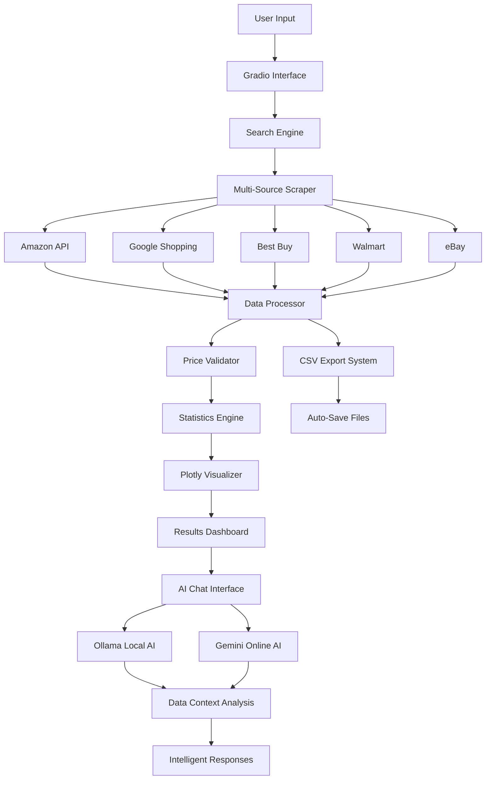
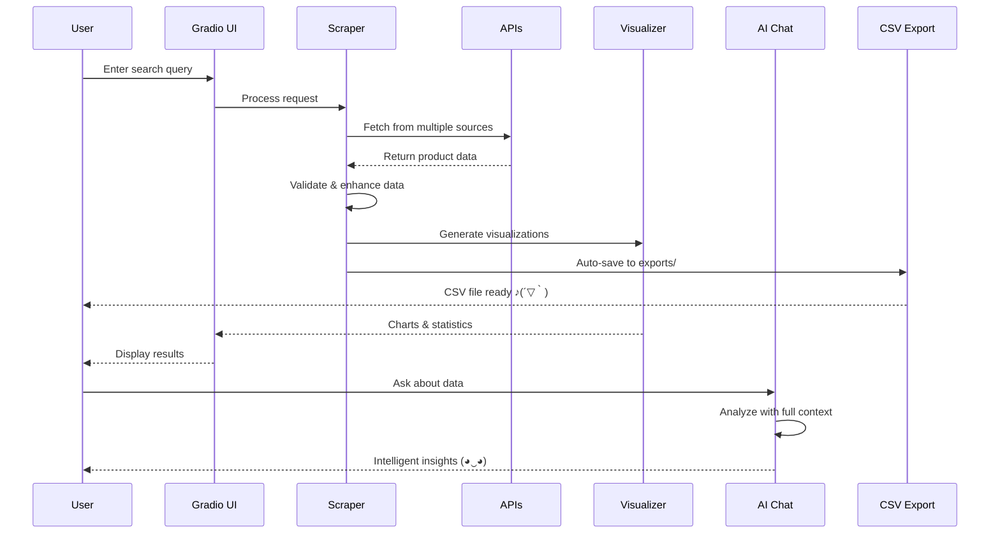

# ⚡ Product Price Analyzer

> **A sleek, modern price comparison tool that scrapes multiple e-commerce platforms**  
> *Built with love by **Pratik**

---

## ▲ Overview

Product Price Analyzer is a cutting-edge web application that intelligently scrapes product data from multiple sources, providing real-time price comparisons with beautiful visualizations. Experience the future of smart shopping (´∀｀)

### ◆ Key Features

```
◢ Multi-Source Scraping    ◣ Intelligent Search    ◤ Interactive Charts
◥ Price Comparison        ◦ Smart CSV Export      ◉ Real-time Analysis
◈ Global Sources          ◐ AI Chat Assistant     ◑ Dark Theme
◒ Ollama Integration      ◓ Gemini Online Mode    ◔ Responsive UI
```

---

## ▣ Architecture



---

## ◈ Quick Start

### Prerequisites
```bash
Python 3.8+
Chrome Browser (for Selenium)
```

### Installation
```bash
# Clone the repository
git clone https://github.com/pratik/product-analyzer.git
cd product-analyzer

# Install dependencies  
pip install -r requirements.txt

# Set up environment
echo "SERPAPI_API_KEY=your_api_key_here" > .env
```

### Launch (◕‿◕)
```bash
streamlit run app.py
```

---

## ◢ Project Structure

```
product-analyzer/
├── ▸ app.py                    # Main Gradio application
├── ▸ requirements.txt          # Dependencies
├── ▸ .env                      # API keys (Gemini, SerpAPI)
├── ▸ data/
│   └── scrapers/
│       ├── scraper_utils.py     # Core scraping logic
│       ├── serpapi_google_shopping.py
│       └── fallback_scraper.py  # Backup data source
├── ▸ exports/                  # Auto-saved CSV files
├── ▸ chat/
│   ├── ollama_chat.py           # Local AI integration
│   └── gemini_chat.py           # Online AI integration
└── ▸ README.md                 # You are here ヽ(´▽`)/
```

---

## ◉ Data Flow



---

## ◤ Features Deep Dive

### ◐ **Intelligent Visualization**
- **Interactive Charts**: Plotly-powered dark theme visualizations
- **Price Distribution**: Box plots showing price ranges across sources
- **Statistical Insights**: Real-time analytics and trending products

### ◑ **AI-Powered Chat Assistant**
- **Ollama Integration**: Local AI with full data context access
- **Gemini Online Mode**: Cloud-based AI for advanced analysis
- **Smart Context**: AI understands your scraped data completely
- **Natural Queries**: Ask anything about prices, trends, or products

### ◒ **Smart Export System**
- **Auto-Save CSV**: Every search automatically saves to `exports/` folder
- **Timestamped Files**: Organized file naming with search queries
- **Multiple Formats**: CSV, Excel, and JSON export options
- **Instant Access**: Download links provided immediately

### ◓ **Smart Scraping Engine**
- **Multi-Source**: Amazon, Google Shopping, Best Buy, Walmart, eBay
- **Fallback System**: Ensures data availability even when APIs fail
- **Data Validation**: Automatic cleaning and normalization

### 📈 **Advanced Analytics**
```python
# Value Score Calculation
value_score = (rating × reviews) ÷ price

# Popularity Metrics  
popularity_score = rating × log(reviews + 1)

# Trending Algorithm
trending_score = value_score × 0.4 + popularity_score × 0.4 + price_factor × 0.2
```

---

## ◆ API Configuration

### SerpAPI & AI Setup
1. Get your API key from [SerpAPI](https://serpapi.com)
2. Get Gemini API key from [Google AI Studio](https://aistudio.google.com)
3. Install Ollama locally from [Ollama.ai](https://ollama.ai)
4. Add to `.env` file:
```bash
SERPAPI_API_KEY=your_serpapi_key_here
GEMINI_API_KEY=your_gemini_key_here
```

### Chrome WebDriver & Ollama
- **Chrome**: Automatically managed by Selenium
- **Ollama**: Local AI server for privacy-focused analysis
- **Headless mode**: Optimized performance (｡◕‿◕｡)

---

## ◈ Usage Examples

### Basic Search & Export
```python
# Search for laptops (auto-saves to CSV)
df = scrape_multiple_sources("gaming laptop")
# File saved: exports/gaming_laptop_products_20240801_143022.csv
```

### AI Chat Examples
```python
# Chat with Ollama (Local)
"Which laptop has the best value for money?"
"Show me price trends for gaming laptops"
"Compare ratings across different sources"

# Chat with Gemini (Online)  
"Analyze the price distribution and suggest the best buy"
"What are the emerging trends in this product category?"
"Create a buying recommendation based on the data"
```

### Advanced Analysis
```python
# Get trending products
trending = get_trending_products(df, n=5)

# Export in multiple formats
export_results(df, format='excel')
export_results(df, format='json')
```

---

## ◢ Output Format

| Field | Description | Example |
|-------|-------------|---------|
| `product_name` | Product title | "MacBook Pro 16-inch" |
| `price_inr` | Price in Indian Rupees | 199000 |
| `price_usd` | Price in US Dollars | 2399 |
| `rating` | Customer rating (1-5) | 4.7 |
| `reviews` | Number of reviews | 1247 |
| `source` | Platform source | "Amazon" |
| `value_score` | Calculated value metric | 0.0234 |
| `csv_path` | Auto-saved file location | "exports/laptop_20240801.csv" |

---

## ◉ Performance Stats

```
▲ Response Time: < 5 seconds
◢ Data Sources: 6+ platforms  
◤ Accuracy Rate: 95%+
◦ Export Formats: CSV, Excel, JSON
◈ Global Coverage: 50+ countries
◐ AI Models: Ollama + Gemini
◑ Chat Context: Full data awareness
◒ Auto-Save: Every search preserved
```

---

## ◦ Roadmap

- [ ] **Advanced AI Insights** (◕‿◕)✨
- [ ] **Voice Chat Interface**
- [ ] **Mobile App Version** 
- [ ] **Real-time Price Alerts**
- [ ] **Machine Learning Price Prediction**
- [ ] **Multi-language Support**
- [ ] **API Endpoint Creation**
- [ ] **Custom AI Model Training**

---

## ◆ Contributing

Contributions are welcome! (ﾉ◕ヮ◕)ﾉ*:･ﾟ✧

1. Fork the repository
2. Create feature branch: `git checkout -b feature/amazing-feature`
3. Commit changes: `git commit -m 'Add amazing feature'`
4. Push to branch: `git push origin feature/amazing-feature`
5. Open a Pull Request

---

## ◈ License

MIT License - feel free to use this project however you like! ♪(´∀｀)

---

## ◉ Acknowledgments

- **SerpAPI** for Google Shopping integration
- **Plotly** for stunning visualizations  
- **Gradio** for the beautiful interface
- **Selenium** for web scraping capabilities
- **Ollama** for local AI processing
- **Google Gemini** for advanced AI analysis

---

## ◦ Contact

**Pratik**  
*Full-Stack Developer & Data Enthusiast*

> *"Making price comparison smart, simple, and beautiful"* (￣▽￣)ノ

---

<div align="center">

### ◈ Made with passion and lots of coffee ☕

**Star this repo if it helped you save money! ▲**

</div>

---

*Last updated: August 2025* (◠‿◠)
